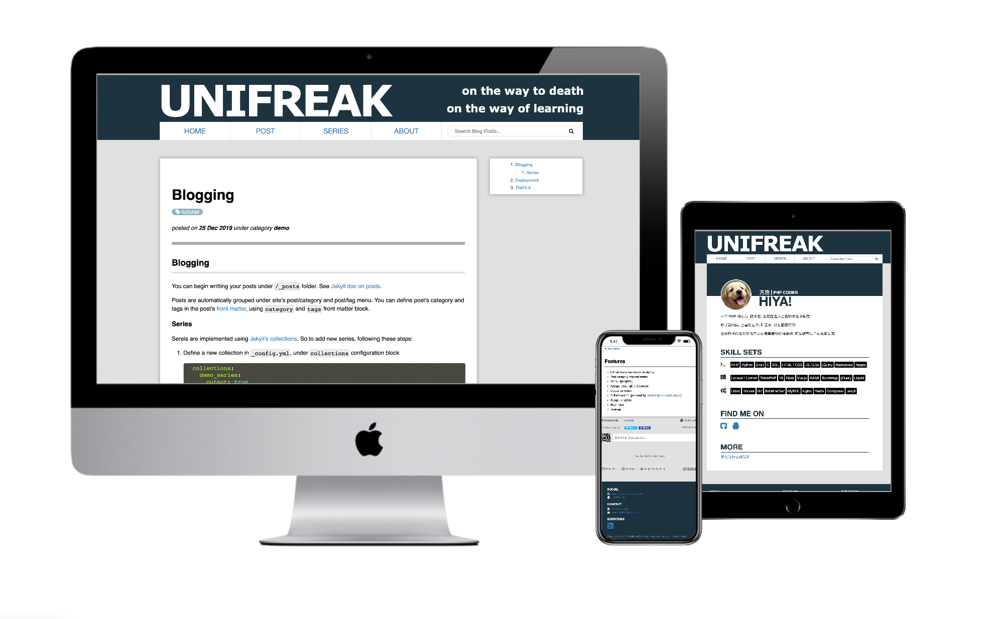

# Textalic

[](https://jekyll-themes.com)



**Textalic** is a simple, responsive jekyll theme focus on blogging. Here is
a [live demo](https://unifreak.github.io/jekyll-theme-textalic/).

## Features

- Post category, tag and series
- Github flavored markdown rendering
- LaTeX and ascii math notation rendering
- Disqus comment and Gitalk comment
- Fulltext search (powered by [jekyll-simple-search plugin](https://github.com/christian-fei/Simple-Jekyll-Search))
- Code highlighting
- Autogenerate table of content
- Google analytics
- Atom feed
- Sitemap

## Install & Configuration

### Set up jekyll

Make sure you have set up jekyll correctly. See [the official jekyll doc](https://jekyllrb.com/docs/).

### Clone this repo

Clone this repo into to your local machine, then `cd` to the root directory of
your local copy. Here is an overview of the project's file structure:

```console
jekyll-theme-textalic
├── 404.html                    # 404 page
├── Gemfile
├── LICENCE
├── _config.yml                 # Main config
├── _data
│   └── me.yml                  # Personal info config
├── _demo_series                # A demo series, add series into series folder
│   └── demo_series_post_1.md
├── _includes
├── _layouts
├── _posts
│   └── 2019-12-25-Intro.md     # Add new post here
├── _sass
├── about                       # About page
├── assets                      # images, fonts, css, js...
│   ├── img
│   │   ├── me.png              # Replace with your own, showed in /about page
├── favicon.ico                 # Replace with your own
├── feed.xml
├── index.html
├── resume
│   └── index.md                # You may write your resume here. linked in /about page
├── search.json
├── series
└── tag
```

### Install gems

Run the following command to install required gems defined in `Gemfile`:

```
$ bundle install
```

### Customization

Edit `_config.yml` and `_data/me.yml` to tweek the site configuration to your
need. See corresponding comments in these files for details.

You also should replace the `/favicon.ico` and `/assets/img/me.png` file with
your own.

### Run locally

Run `bundle exec jekyll serve --watch` to run it locally.

## Blogging

You can begin writting your posts under `/_posts` folder.
See [Jekyll doc on posts](https://jekyllrb.com/docs/posts/).

Posts are automatically grouped under site's post/category and post/tag menu.

You can define post's category and tags in the post's [front matter](https://jekyllrb.com/docs/front-matter/),
using `category` and `tags` front matter block.

## Math Notation Support

You can enable latex math support or asciimath support by adding `usemath: latex`
or `usemath: ascii` front matter accordingly. Latex math notation must be wrapped
inside \$\$, and asciimath notation must be wrapped inside \\`.

For detail configuration and math rendering result, see <https://unifreak.github.io/jekyll-theme-textalic/demo/Blogging>

### Series

Series are implemented using [Jekyll's collections](https://jekyllrb.com/docs/collections/).
To add new series, follow these steps:

1. Define a new collection in `_config.yml`, under `collections` configuration block:

    ```yaml
    collections:
      demo_series:
        output: true
    ```

    Note that to make the change to `_config.yml` take effects, you **need to restart jekyll**.

2. Create the series (aka collection) folder `/_demo_series`. Note that the **folder name begin with `_`**.

3. By adding new post under the series folder, you add post under the corresponding series.

## Deployment

See [Jekyll doc on deployment](https://jekyllrb.com/docs/deployment/).

## That's it

Happy blogging!