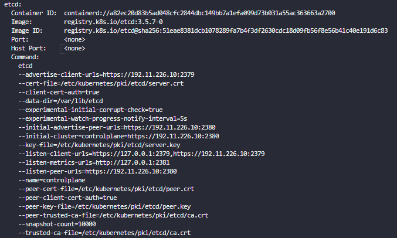
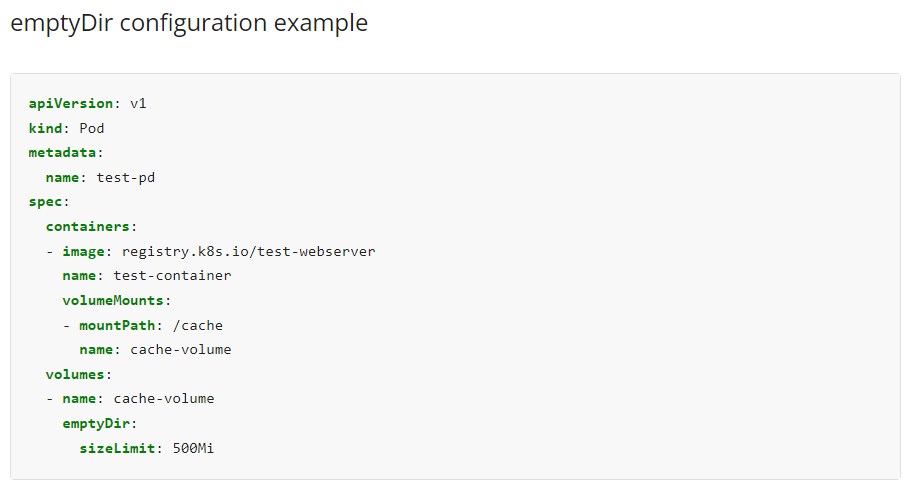

---
---

# Q1.

Take a backup of the etcd cluster and save it to `/opt/etcd-backup.db`.


1. etcd 파드의 세부사항 확인하기

```bash
$ k describe pod etcd -n kube-system
```




2. etcdctl로 스냅샷 백업하기: 공식 홈페이지 내용

```bash
$ ETCDCTL_API=3 etcdctl --endpoints=https://127.0.0.1:2379 \
  --cacert=<trusted-ca-file> --cert=<cert-file> --key=<key-file> \
  snapshot save <backup-file-location>
```

- trust-ca-file &rarr; <code>/etc/kubernetes/pki/etcd/ca.crt</code>
- cert-file &rarr; <code>/etc/kubernetes/pki/etcd/server.crt</code>
- key-file &rarr; <code>/etc/kubernetes/pki/etcd/server.key</code>


3. 내용을 대체하여 커맨드 입력

```
$ ETCDCTL_API=3 etcdctl --endpoints=https://127.0.0.1:2379 \
  --cacert=/etc/kubernetes/pki/etcd/ca.crt --cert=/etc/kubernetes/pki/etcd/server.crt \
  --key=/etc/kubernetes/pki/etcd/server.key \
  snapshot save /opt/etcd-backup.db
```

---

# Q2.

Create a Pod called <code>redis-storage</code> with iamge:<code>redis:alpine</code> with a Volume of type <code>emptyDir</code> that lasts for the life of the Pod.

- Pod named 'redis-storage' created
- Pod 'redis-storage' uses Volume type of emptyDir
- Pod 'redis-storage' uses volumeMount with mountPath = /data/redis


1. kubectl cheat 활성화

```bash
$ source <(kubectl completion bash) 
$ echo "source <(kubectl completion bash)" >> ~/.bashrc 
```

```bash
$ alias k=kubectl
$ complete -o default -F __start_kubectl k
```


2. --dry-run 커맨드를 활용하여 pod 생성 yaml 파일 가져오기

```bash
$ k run redis-storage --image=redis:alpine --dry-run-client -o yaml > 2.yaml
```


3. emptyDir 내용 공식 홈페이지에서 검색




4. 저장된 yaml 파일에 volume 부분 추가하기

```yaml
apiVersion: v1
kind: Pod
metadata:
  creationTimestamp: null
  labels:
    run: redis-storage
  name: redis-storage
spec:
  containers:
  - image: redis:alpine
    name: redis-storage
    resources: {}
    volumeMounts:
    - mountPath: /data/redis
      name: empty-volume
  volumes:
  - name: empty-volume
  	emptyDir:
  	  sizeLimit: 500Mi
  dnsPolicy: ClusterFirst
  restartPolicy: Always
status: {}
```


5. apply 커맨드 실행하기

---

# Q3. 

Create a new pod called <code>super-user-pod</code> with image <code>busybox:1.28</code>. Allow the pod to be able to set <code>system_time</code>

- The container should sleep for 4800 seconds.
- PodL super-user-pod
- Container Image: busybox:1.28
- Is SYS_TIME capability set for the container?


1. kubectl cheat 활성화

```bash
$ source <(kubectl completion bash) 
$ echo "source <(kubectl completion bash)" >> ~/.bashrc 
```

```bash
$ alias k=kubectl
$ complete -o default -F __start_kubectl k
```


2. --dry-run 커맨드를 활용해 yaml 파일 생성하기

```bash
$ kubectl run super-user-pod --image=busybox:1.28 --dry-run -o yaml > 3.yaml
```


3. 쿠버네티스 공식 문서에서 SYS_TIME 검색하기 &rarr;  Security context에서 찾을 수 있음

```yaml
apiVersion: v1
kind: Pod
metadata:
  name: security-context-demo-4
spec:
  containers:
  - name: sec-ctx-4
    image: gcr.io/google-samples/node-hello:1.0
    securityContext:
      capabilities:
        add: ["NET_ADMIN", "SYS_TIME"]
```


위의 yaml 파일을 수정하여 구성에 맞는 파일 만들기

```
```


---

# Q4.

A pod definition file is created at `/root/CKA/use-pv.yaml`. Make use of this manifest file and mount the persistent volume called `pv-1`. Ensure the pod is running and the PV is bound.

- mountPath: `/data`

- persistentVolumeClaim Name: `my-pvc`


1. kubectl cheat 활성화

```bash
$ source <(kubectl completion bash) 
$ echo "source <(kubectl completion bash)" >> ~/.bashrc 
```

```bash
$ alias k=kubectl
$ complete -o default -F __start_kubectl k
```


2. PersistentVolumeClaim(PVC) 존재 유무 확인

```
$ k get pvc -A
```


3. PVC 구성 yaml 공식 홈페이지에서 찾기

```yaml
apiVersion: v1
kind: PersistentVolumeClaim
metadata:
  name: my-pvc
spec:
  accessModes:
  - ReadWriteOnce
  resources:
    requests:
       storage: 10Mi
```


4. 기존의 use-pv.yaml 파일의 구성 Claim As Volumes로 수정하기 [이 때 기존 이미지가 무엇인지 꼭 기록해 놓기]

```yaml
apiVersion: v1
kind: Pod
metadata:
  creationTimestamp: null
  labels:
    run: use-pv
  name: use-pv
spec:
  containers:
  - image: nginx
    name: use-pv
    volumeMounts:
    - mountPath: "/data"
      name: mypd
  volumes:
    - name: mypd
      persistentVolumeClaim:
        claimName: my-pvc
```

---

# Q5.

Create a new deployment called `nginx-deploy`, with image `nginx:1.16` and `1` replica. Next upgrade the deployment to version `1.17` using rolling update.

- Deployment : nginx-deploy. Image: nginx:1.16
- Image: nginx:1.16
- Task: Upgrade the version of the deployment to 1:17
- Task: Record the changes for the image upgrade


Explore the `--record` option while creating the deployment while working with the deployment definition file. Then make use of the `kubectl apply` command to create or update the deployment.

To create a deployment definition file `nginx-deploy`:

```bash
$ kubectl create deployment nginx-deploy --image=nginx:1.16 --dry-run=client -o yaml > deploy.yaml
```


To create a resource from definition file and to record [apply할 때 <code>--record</code> 사용]:

```bash
$ kubectl apply -f deploy.yaml --record
```


To view the history of deployment `nginx-deploy`:

```bash
$ kubectl rollout history deployment nginx-deploy
```


To upgrade the image to next given version:

```bash
$ kubectl set image deployment/nginx-deploy nginx=nginx:1.17 --record
```


To view the history of deployment `nginx-deploy`:

```bash
$ kubectl rollout history deployment nginx-deploy
```


# Q6.

Create a new user called `john`. Grant him access to the cluster. John should have permission to `create, list, get, update and delete pods` in the `development` namespace . The private key exists in the location: `/root/CKA/john.key` and csr at `/root/CKA/john.csr`.

`Important Note`: As of kubernetes 1.19, the CertificateSigningRequest object expects a `signerName`.

Please refer the documentation to see an example. The documentation tab is available at the top right of terminal.


아래의 절차대로 문제 풀이가 진행된다.

1. 쿠버네티스에 인증서 서명 요청을 만들어 승인 받기
2. Role 만들기
3. Rolebinding 만들기


## 쿠버네티스에 인증서 서명 요청을 만들어 승인 받기

### CertificateSigningRequest 검색


### Create a CertificateSigningRequest 옮겨오기 > vi csr.yaml

```yaml
apiVersion: certificates.k8s.io/v1
kind: CertificateSigningRequest
metadata:
  name: john-developer
spec:
  request: LS0tLS1CRUdJTiBDRVJUSUZJQ0FURSBSRVFVRVNULS0tLS0KTUlJQ1ZqQ0NBVDRDQVFBd0VURVBNQTBHQTFVRUF3d0dZVzVuWld4aE1JSUJJakFOQmdrcWhraUc5dzBCQVFFRgpBQU9DQVE4QU1JSUJDZ0tDQVFFQTByczhJTHRHdTYxakx2dHhWTTJSVlRWMDNHWlJTWWw0dWluVWo4RElaWjBOCnR2MUZtRVFSd3VoaUZsOFEzcWl0Qm0wMUFSMkNJVXBGd2ZzSjZ4MXF3ckJzVkhZbGlBNVhwRVpZM3ExcGswSDQKM3Z3aGJlK1o2MVNrVHF5SVBYUUwrTWM5T1Nsbm0xb0R2N0NtSkZNMUlMRVI3QTVGZnZKOEdFRjJ6dHBoaUlFMwpub1dtdHNZb3JuT2wzc2lHQ2ZGZzR4Zmd4eW8ybmlneFNVekl1bXNnVm9PM2ttT0x1RVF6cXpkakJ3TFJXbWlECklmMXBMWnoyalVnald4UkhCM1gyWnVVV1d1T09PZnpXM01LaE8ybHEvZi9DdS8wYk83c0x0MCt3U2ZMSU91TFcKcW90blZtRmxMMytqTy82WDNDKzBERHk5aUtwbXJjVDBnWGZLemE1dHJRSURBUUFCb0FBd0RRWUpLb1pJaHZjTgpBUUVMQlFBRGdnRUJBR05WdmVIOGR4ZzNvK21VeVRkbmFjVmQ1N24zSkExdnZEU1JWREkyQTZ1eXN3ZFp1L1BVCkkwZXpZWFV0RVNnSk1IRmQycVVNMjNuNVJsSXJ3R0xuUXFISUh5VStWWHhsdnZsRnpNOVpEWllSTmU3QlJvYXgKQVlEdUI5STZXT3FYbkFvczFqRmxNUG5NbFpqdU5kSGxpT1BjTU1oNndLaTZzZFhpVStHYTJ2RUVLY01jSVUyRgpvU2djUWdMYTk0aEpacGk3ZnNMdm1OQUxoT045UHdNMGM1dVJVejV4T0dGMUtCbWRSeEgvbUNOS2JKYjFRQm1HCkkwYitEUEdaTktXTU0xMzhIQXdoV0tkNjVoVHdYOWl4V3ZHMkh4TG1WQzg0L1BHT0tWQW9FNkpsYWFHdTlQVmkKdjlOSjVaZlZrcXdCd0hKbzZXdk9xVlA3SVFjZmg3d0drWm89Ci0tLS0tRU5EIENFUlRJRklDQVRFIFJFUVVFU1QtLS0tLQo=
  signerName: kubernetes.io/kube-apiserver-client
  usages:
  - client auth	
```

- <code>request</code> is the base64 encoded value of the CSR file content. You can get the content using this command:

```bash
$ cat myuser.csr | base64 | tr -d "\n"
```


### john.csr 파일 인코딩하기

```bash
$ cat john.csr | base64 | tr -d "\n"
```


### 출력 내용을 복사하여 request 대체하기

```yaml
apiVersion: certificates.k8s.io/v1
kind: CertificateSigningRequest
metadata:
  name: john-developer
spec:
  signerName: kubernetes.io/kube-apiserver-client
  request: LS0tLS1CRUdJTiBDRVJUSUZJQ0FURSBSRVFVRVNULS0tLS0KTUlJQ1ZEQ0NBVHdDQVFBd0R6RU5NQXNHQTFVRUF3d0VhbTlvYmpDQ0FTSXdEUVlKS29aSWh2Y05BUUVCQlFBRApnZ0VQQURDQ0FRb0NnZ0VCQUt2Um1tQ0h2ZjBrTHNldlF3aWVKSzcrVVdRck04ZGtkdzkyYUJTdG1uUVNhMGFPCjV3c3cwbVZyNkNjcEJFRmVreHk5NUVydkgyTHhqQTNiSHVsTVVub2ZkUU9rbjYra1NNY2o3TzdWYlBld2k2OEIKa3JoM2prRFNuZGFvV1NPWXBKOFg1WUZ5c2ZvNUpxby82YU92czFGcEc3bm5SMG1JYWpySTlNVVFEdTVncGw4bgpjakY0TG4vQ3NEb3o3QXNadEgwcVpwc0dXYVpURTBKOWNrQmswZWhiV2tMeDJUK3pEYzlmaDVIMjZsSE4zbHM4CktiSlRuSnY3WDFsNndCeTN5WUFUSXRNclpUR28wZ2c1QS9uREZ4SXdHcXNlMTdLZDRaa1k3RDJIZ3R4UytkMEMKMTNBeHNVdzQyWVZ6ZzhkYXJzVGRMZzcxQ2NaanRxdS9YSmlyQmxVQ0F3RUFBYUFBTUEwR0NTcUdTSWIzRFFFQgpDd1VBQTRJQkFRQ1VKTnNMelBKczB2czlGTTVpUzJ0akMyaVYvdXptcmwxTGNUTStsbXpSODNsS09uL0NoMTZlClNLNHplRlFtbGF0c0hCOGZBU2ZhQnRaOUJ2UnVlMUZnbHk1b2VuTk5LaW9FMnc3TUx1a0oyODBWRWFxUjN2SSsKNzRiNnduNkhYclJsYVhaM25VMTFQVTlsT3RBSGxQeDNYVWpCVk5QaGhlUlBmR3p3TTRselZuQW5mNm96bEtxSgpvT3RORStlZ2FYWDdvc3BvZmdWZWVqc25Yd0RjZ05pSFFTbDgzSkljUCtjOVBHMDJtNyt0NmpJU3VoRllTVjZtCmlqblNucHBKZWhFUGxPMkFNcmJzU0VpaFB1N294Wm9iZDFtdWF4bWtVa0NoSzZLeGV0RjVEdWhRMi80NEMvSDIKOWk1bnpMMlRST3RndGRJZjAveUF5N05COHlOY3FPR0QKLS0tLS1FTkQgQ0VSVElGSUNBVEUgUkVRVUVTVC0tLS0tCg==
  usages:
  - digital signature
  - key encipherment
  - client auth
```


### Role 생성하기[namespace 꼭 빼먹지 말 것!]

```bash
$ k create role developer --verb=create,get,list,update,delete --resource=pods -n development
```


### Rolebinding 생성하기[**namespace** 꼭 빼먹지 말 것!]

```bash
$ kubectl create rolebinding developer-role-binding --role=developer --user=john --namespace=development
```


To verify the permission from kubectl utility too

```bash
$ kubectl auth can-i update pods --as=john --namespace=development
```


---

# Q7.

Create a nginx pod called `nginx-resolver` using image `nginx`, expose it internally with a service called `nginx-resolver-service`. Test that you are able to look up the service and pod names from within the cluster. Use the image: `busybox:1.28` for dns lookup. Record results in `/root/CKA/nginx.svc` and `/root/CKA/nginx.pod`


Use the command `kubectl run` and create a nginx pod and busybox pod. Resolve it, nginx service and its pod name from `busybox` pod.

### Nginx Pod 생성 및 내부 노출:

```bash
kubectl run nginx-resolver --image=nginx

# ~ expose it internally이므로 ClusterIP를 사용해야 한다.
kubectl expose pod nginx-resolver --name=nginx-resolver-service --port=80
```


busybox가 `nslookup` 테스트 용이므로 `sleep` 커맨드를 활용해 실행만 되게 만든다.

```bash
$ k run busybox --image=busybox:1.28 -- sleep 4000 
```


Pod 'busybox'에 `nslookup` 커맨드를 사용해 nginx-resolver-service를 계속 보게 한다.

```bash
$ k exec busybox -- nslookup nginx-resolver-service
```


문제에 나온대로 결과물을 `/root/CKA/nginx.pod`에 출력 저장한다.

```bash
$ k exec busybox -- nslookup nginx-resolver-service > /root/CKA/nginx.pod
```


서비스를 해결하였으니 이제 Pod을 바라보게 할 차례이다.

```
$ k get pod -o wide
```

커맨드를 입력해 pod의 IP 주소를 가져온다.


DNS for Services and Pods 페이지 확인하기 (service와 다르게 pod는 ip 주소를 입력해야 함)

```bash
$ kubectl exec busybox -- nslookup pod-ip-address.default.pod.cluster.local > root/CKA/nginx.pod
```


### DNS 조회를 위한 Busybox Pod 생성:

'busybox:1.28' 이미지를 사용하여 임시로 'test-nslookup'라는 이름의 pod을 생성하고, 'nslookup' 명령을 실행하여 'nginx-resolver-service'의 IP 주소를 조회한다.

```bash
$ kubectl run test-nslookup --image=busybox:1.28 --rm -it --restart=Never -- nslookup nginx-resolver-service

$ kubectl run test-nslookup --image=busybox:1.28 --rm -it --restart=Never -- nslookup nginx-resolver-service > /root/CKA/nginx.svc
```


Get the IP of the `nginx-resolver` pod and replace the dots(.) with hyphon(-) which will be used below.

```bash
kubectl get pod nginx-resolver -o wide
kubectl run test-nslookup --image=busybox:1.28 --rm -it --restart=Never -- nslookup <P-O-D-I-P.default.pod> > /root/CKA/nginx.pod
```

---

# Q8.

Create a static pod on `node01` called `nginx-critical` with image `nginx` and make sure that it is recreated/restarted automatically in case of a failure.

Use `/etc/kubernetes/manifests` as the Static Pod path for example.


- Static Pod을 생성하기 위한 yaml 코드를 아래의 커맨드를 입력하여 가져온다.

```sh
$ kubectl run nginx-critical --image=nginx --dry-run=client -o yaml > static.yaml
```


- cat 구문을 이용하여 controlplane에서 node01으로 yaml 구문을 복사해 붙인다. 이 때, 디렉토리는 `/etc/kubernetes/manifests/~.yaml`d이다.

```bash
root@node01: cat > /etc/kubernetes/manifests/sample.yaml 
```


