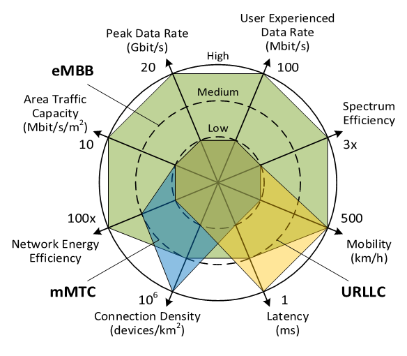

This post is a summary based on the book "5G Core Networks: Powering Digitalization." Additionally, it includes content from lectures by Suryabh S.

# Why do we need 5G?

- New Use cases other than just Mobile Broadband
  - eMBB(enhanced Mobile Broadband)
  - URLLC(Ultra-Reliable Low-Latency Communications)
  - mMTC(massive Machine Type Communications)

    
 <!-- 왼쪽 컨텐츠 -->
       <h3>Metrics for comparison</h3>
        <ul>
            <li>Peak Data Rate</li>
            <li>User Exp Data Rate</li>
            <li>Area traffic Capacity</li>
            <li>Network efficiency</li>
            <li>Connection density</li>
            <li>Mobility</li>
            <li>Latency</li>
            <li>Spectrum efficiency</li>
        </ul>
    

    
 <!-- 오른쪽 그림 -->
        
    

# 5G requirements

- As seen before the main use cases for 5G are - eMBB, URLLC, and mMTC
- Some observations worth nothing:
  - eMBB - High importance on
    - Peak data rate
    - Area traffic capacity
    - Network efficiency
    - Spectrum efficiency
    - Mobility
  - Latency
    - High importance on Mobility
    - High importance on Latency
  - mMTC
    - High importance on connection density

# Enabling 5G technologies > How?

## 5G KPIs

### Spectral and Energy efficiency

- Massive MIMO
- Full-Duplex Radio
- Flexible Duplex
- New Config, modulation and Waveforms
- Non-orthogonal multiple Access

### New specturm

- mmWave bands
- Unlicensed Bands
- Spectrum Sharing
- Heterogeneous Networks

### Net Network Architecture

- Software Defined Networks
- Network Virtualization
- Ultra-dense networks
- Cloud/Virtual RAN
- Machine-to-Machine communications
- Mobile Edge Computing

