​    본 포스팅은 경희대학교 이동통신연구실과 HFR의 공동 연구과제를 수행하며 3GPP 표준을 정리한 글입니다. **3GPP TS 38.455에 근거하여 작성되었습니다.**

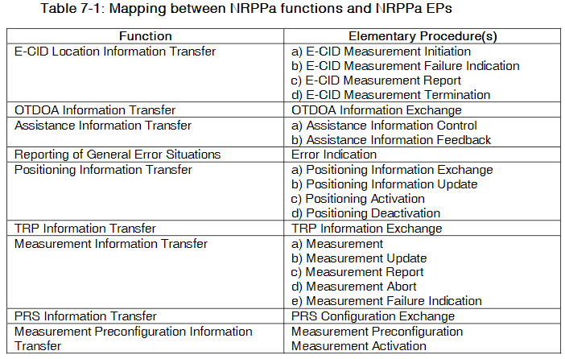

모든 EP(Elementary Procedure)들은 Class1 과 Class2로 나누어져 있다. 

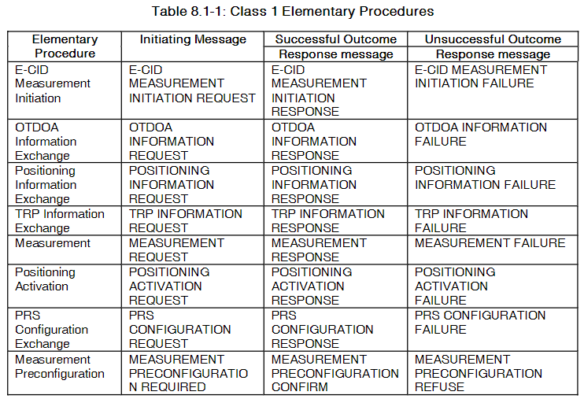

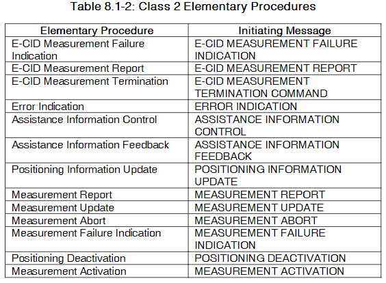

---

## Location Information Transfer Procedures

### E-CID(Enhanced Cell ID) Measurement Initiation

- General

  The purpose of E-CID Measurement Initiation procedures is to allow the LMF to request the NG-RAN node to report E-CID measurements used by LMF to compute the location of the UE

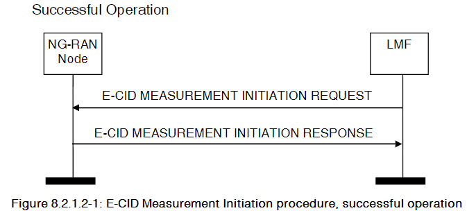

  LMF는 E-CID 측정을 위해 MEASUREMENT INITIATION REQUEST 메시지를 보내는 것으로 procedure를 시작함. NG-RAN 노드가 요청된 E-CID 측정을 시작할 수 있다면, E-CID MEASUREMENT INITIATION RESPONSE 메시지로 응답해야 함. "Cell-ID" 이외의 측정 결과가 요청된 경우, E-CID MEASUREMENT INITIATION RESPONSE 메시지의 Measured Results IE에 포함되어야 함

**Report Characteristics IE가 "OnDemand"로 설정된 경우:**

- NG-RAN 노드는 측정 결과를 E-CID MEASUREMENT INITIATION RESPONSE 메시지에 포함하여 반환해야 함
- 가능한 경우, NG-RAN Access Point PositionIE를 E-CID Measurement ResultIE에 포함시켜야 함
- 이 경우, LMF는 E-CID 측정이 NG-RAN 노드에 의해 종료되었다고 간주해야 함
- Cell Portion ID IE가 사용 가능한 경우, NG-RAN 노드는 이를 E-CID MEASUREMENT INITIATION RESPONSE 메시지에 포함해야 함
- Cell Portion ID IE를 수신하면 LMF는 이 값을 측정 셀의 Cell portion 값으로 쓸 수 있음
- Report Characteristics IE가 "OnDemand"로 설정되고 Inter-RAT Measurement QuantitiesIE가 E-CID MEASUREMENT INITIATION REQUEST 메시지에 포함된 경우, NG-RAN 노드는 Inter-RAT Measurement ResultIE를 E-CID MEASUREMENT INITIATION RESPONSE 메시지에서 제공해야 함
- Report Characteristics IE가 "OnDemand"로 설정되고 WLAN Measurement Quantities IE가 E-CID MEASUREMENT INITIATION REQUEST 메시지에 포함된 경우, NG-RAN 노드는 WLAN Measurement Result IE를 E-CID MEASUREMENT INITIATION RESPONSE 메시지에서 제공해야 함

**Report Characteristics IE가 "Periodic"로 설정된 경우:**

- NG-RAN 노드는 요청된 측정을 시작하고 E-CID MEASUREMENT INITIATION RESPONSE 메시지에 E-CID Measurement Result IE나 Cell Portion ID IE를 포함시키지 않아야 함

- 그런 다음, NG-RAN 노드는 주기적으로 요청된 보고 주기로 측정을 시작하는 E-CID Measurement Report 프로시저를 시작해야 함

  

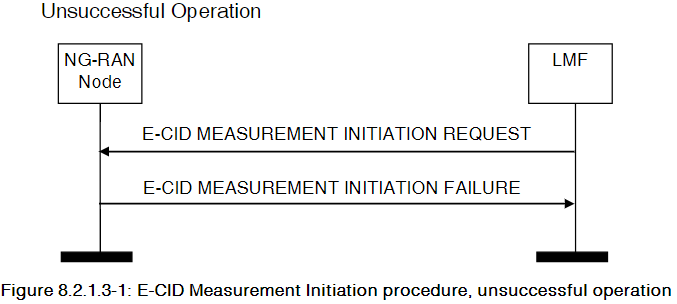

  If the NG-RAN node is not able to initiate at least one of the requested E-CID measurements, the NG-RAN node shall respond with an E-CID MEASUREMENT INITIATION FAILURE message

### E-CID Measurement Failure Indication

- General

 The purpose of the E-CID Measurement Failure Indication procedure is for the NG-RAN node to notify the LMF that the E-CID measurements previously requested with the E-CID Measurement Initiation procedure can no longer be reported

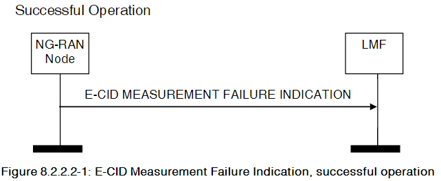

  Upon reception of the E-CID MEASUREMENT FAILURE INDICATION message, the LMF shall consider that the E-CID measurements for the UE have been terminated by the NG-RAN node.

### E-CID Measurement Report

- General

  The purpose of E-CID Measurement Report procedure is for the NG-RAN node to provide the E-CID measurements for the UE to the LMF

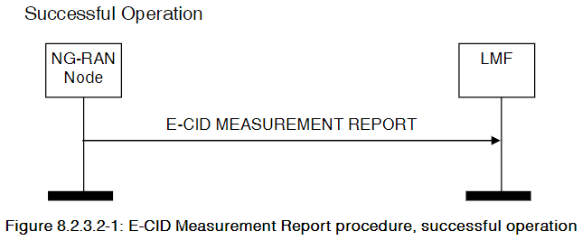

NG-RAN Node가 프로시저를 시작하려면 E-CID MEASUREMENT REPORT 메시지를 보낸다. 이 메시지는 해당 E-CID MEASUREMENT INITIATION REQUEST 메시지에서 만들어진 측정 구성에 따라 E-CID 결과를 포함한다.

프로시저를 간단하게 정리하면 다음과 같다.

1. NG-RAN 노드는 E-CID MEASUREMENT REPORT 메시지를 보낸다.
2. E-CID MEASUREMENT REPORT 메시지는 E-CID MEASUREMENT INITIATION REQUEST 메시지에 따른 측정 결과를 포함하고 있다.
3. 만약 "Cell-ID" 이외의 측정 결과가 요청된 경우, Measured Results IE를 포함한다.
4. 가능하다면, NG-RAN 노드는 NG-RAN Access Point Position IE 또는 Geographical Coordinates IE를 E-CID MEASUREMENT REPORT 메시지에 포함한다.
5. 가능하다면, Cell Portion ID IE도 포함한다.

### E-CID Measurement Termination

- General

  The purpose of E-CID Measurement Termination procedure is to terminate periodical E-CID measurements for the UE performed by the NG-RAN node.

The LMF initiates the procedure by generating an E-CID MEASUREMENT TERMINATION COMMAND message.

### OTDOA Information Exchange

- General

  The purpose of the OTDOA Information Exchange procedure is to allow the LMF to request the NG-RAN node to transfer OTDOA information to the LMF.

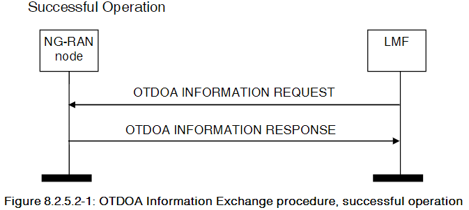

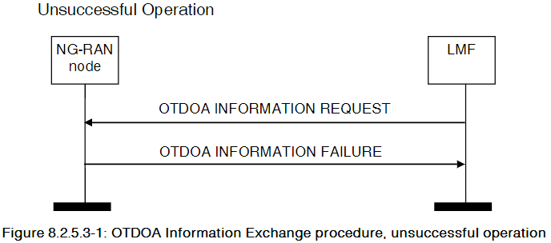

---

## Positioning Information Exchange

- General

The Positioning Information Exchange procedure is initiated by the LMF to request to the NG-RAN node positioning information for the UE. This procedure applies only if the NG-RAN node is a gNB.

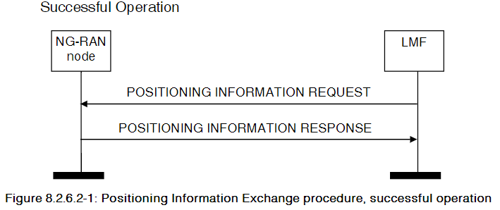

1. **LMF 초기화 프로세스**
   	- NG-RAN 노드에게 POSITIONING INFORMATION REQUEST 메시지를 보내어 프로시저를 시작한다.

2. **SRS 전송 특성 요청 시**
   - POSITIONING INFORMATION REQUEST 메시지에 Requested SRS Transmission Characteristics IE이 포함된 경우, NG-RAN 노드는 이 정보를 고려하여 UE의 SRS 전송을 구성하며, POSITIONING INFORMATION RESPONSE 메시지에 SRS(Sounding Reference Signal) Configuration IE 및 SFN Initialization Time IE를 포함해야 한다.

3. **SRS 전송 특성 요청 시 - Spatial Relation 및 Periodicity**
   - Requested SRS Transmission Characteristics IE에 Spatial Relation Information per SRS Resource IE 및 Periodicity List IE가 모두 포함된 경우, NG-RAN 노드는 Spatial Relation per SRS Resource Item IE 및 Periodicity List Item IE 사이에 일대일 맵핑 관계가 있다고 간주한다.

4. **UE 보고 정보 요청 시**

   - POSITIONING INFORMATION REQUEST 메시지에 UE Reporting InformationIE이 포함된 경우, NG-RAN 노드는 UE의 위치를 결정할 때 적절한 CG-SDT 자원을 할당하는 데 이 정보를 고려할 수 있다.

5. **UE TEG 정보 요청 시 - OnDemand**

   - POSITIONING INFORMATION REQUEST 메시지에 UE TEG Information Request IE이 포함되고 "OnDemand"로 설정된 경우, NG-RAN 노드는 지원하는 경우 POSITIONING INFORMATION RESPONSE 메시지에 UE Tx TEG 연관을 제공해야 한다.

6. **UE TEG 정보 요청 시 - 주기적**

   - UE TEG Information Request IE이 "periodic"으로 설정된 경우, NG-RAN 노드는 POSITIONING INFORMATION RESPONSE 메시지를 전송할 때 이 메시지에 UE Tx TEG 연관을 포함시키지 않아야 한다.

7. **UE TEG 보고 주기 고려**

   - NG-RAN 노드는 UE TEG Reporting PeriodicityIE을 고려하여 UE의 주기적인 UE Tx TEG 연관 보고를 구성하고, 필요한 경우 UE로부터 수신한 UE Tx TEG 연관을 보고하기 위한 Positioning Information Update 프로시저를 시작해야 한다.

     

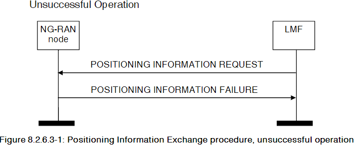

- 만약 POSITIONING INFORMATION REQUEST 메시지에 Requested SRS Transmission CharacteristicsIE이 포함되고 NG-RAN 노드가 UE에 대한 어떤 SRS 전송도 구성할 수 없는 경우, NG-RAN 노드는 적절한 원인 값을 가진 POSITIONING INFORMATION FAILURE 메시지로 응답해야 한다. 
- 대상 UE의 핸드오버가 트리거되었을 경우, NG-RAN 노드는 적절한 원인 값을 가진 POSITIONING INFORMATION FAILURE 메시지를 보내야 한다. 
- NG-RAN 노드가 요청된 정보 중 어떤 것도 제공할 수 없는 경우, NG-RAN 노드는 적절한 원인 값을 가진 POSITIONING INFORMATION FAILURE 메시지로 응답해야 한다.

### Positioning Deactivation

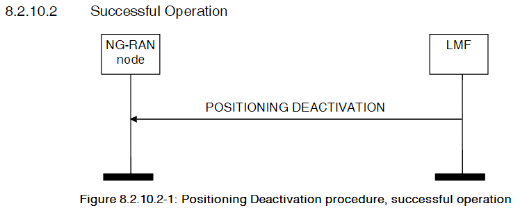

The Positioning Deactivation procedure is initiated by the LMF to indicate to the NG-RAN node that UL SRS transmission should be deactivated in the UE. This procedure applies only if the NG-RAN node is a gNB.

### PRS(Positioning Reference Signal) Configuration Exchange

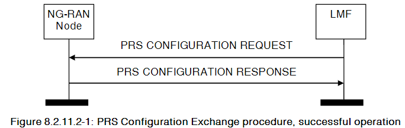

  LMF는 NG-RAN에 PRS CONFIGURATION REQUEST 메세지를 보내 procedure를 시작한다.

- PRS Configuration Request Type IE이 "configure" 상태일 때:
  - NG-RAN 노드는 Requested DL PRS() Transmission Characteristics IE에 포함된 정보를 사용하여 지정된 TRPs(Transmission-Reception Point)에 따라 DL-PRS 전송을 구성해야 한다.
- PRS Configuration Request Type IE이 "off" 상태일 때:
  - NG-RAN 노드는 PRS Transmission Off Information IE에 포함된 정보를 사용하여 지정된 TRP, PRS Resource Set 또는 PRS Resource에 대한 DL-PRS 전송을 중단해야 한다.

  하나 이상의 TRP 중 DL-PRS 전송이 성공적으로 구성 또는 업데이트 된 경우, NG-RAN 노드는 PRS CONFIGURATION RESPONSE 메시지로 응답해야 한다.

### Measurement Preconfiguration

- General
  - The Measurement Preconfiguration procedure allows the LMF to provide necessary information to the serving gNB and request the gNB to preconfigure measurement gap and/or PRS processing window for the UE. This procedure applies only if the NG-RAN node is a gNB.

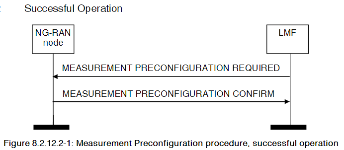

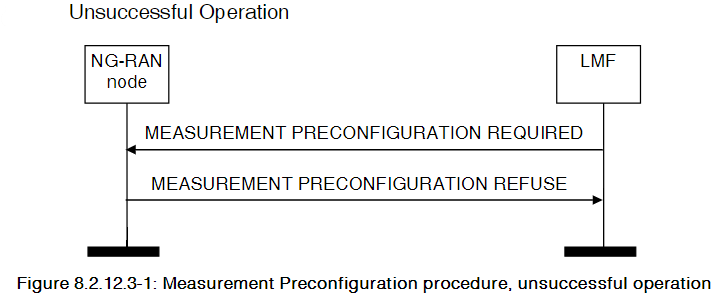

### Measurement Activation

- General
  - The Measurement Activation procedure is initiated by the LMF to request the NG-RAN node to activate or deactivate the preconfigured measurement gap or PRS processing window for the UE. This procedure applies only if the NG-RAN node is a gNB.

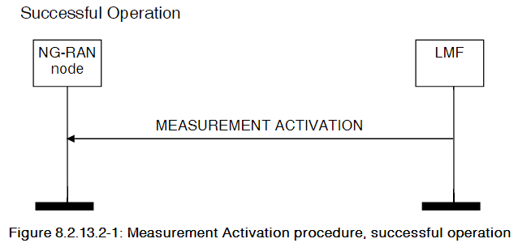

If the PRS Measurement Info List IE is included in the MEASUREMENT ACTIVATION message, the NG-RAN node may take it into account when activating pre-configured measurement gap in the UE.

---

## Management Procedures

### Error Indication

1. General
   - The Error Indication procedure is initiated by a node to report detected errors in one incoming message.
2. Successful Operation

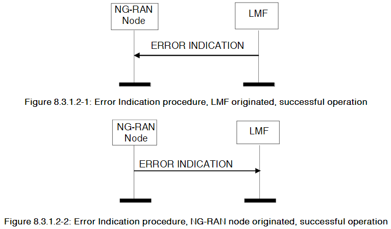

When the conditions defined in caluse 10 are fulfilled, the Error Indication procedure is initiated by an ERROR INDICATION message sent from the receiving node.

ERROR INDICATION 메세지는 적어도 Cause IE 또는 Criticality Diagnostics IE 중 하나를 가지고 있어야 한다.

---

## Assistance Information Transfer Procedures

### Assistance Information Control

1. General
   - The Error Indication procedure is initiated by a node to report detected errors in one incoming message, provided they cannot be reported by an appropriate failure message.

2. Successful Operation

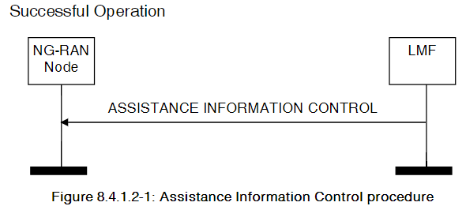

LMF는 ASSISTANCE INFORMATION CONTROL 메시지를 보내 procedure를 시작한다.

- ASSISTANCE INFORMATION CONTROL 메세지 안에 Assistance Information IE가 포함되어 있을 때, NG-RAN 노드는 가능하다면, 이전에 저장된 assistance information을 대체하고, 받은 정보를 사용하여 assistant information broadcast를 구성해야 한다.

- Assistance Information IE에 Broadcast Priority IE가 포함된 경우, NG-RAN 노드는 해당 정보를 Broadcast configuration 시 고려해 볼 수 있다. 동일한 Broadcast Priority 값을 가지는 Assistant information은 동일한 대우를 받는다.(즉, NG-RAN 노드에 broadcast 되지 않음)

- Broadcast IE가 ASSISTANCE INFORMATION CONTROL 메세지 안에 포함되어 있고 "start"로 설정되어 있으면, NG-RAN 노드는 assistant information을 broadcast하기 시작한다.
- Positioning Broadcast Cells IE가 ASSISTANCE INFORMATION CONTROL 메세지에 포함된 경우, NG-RAN은 가능하다면, 받은 assistant information이 이 IE에 포함된 cell에 적용되어야 한다.

3. Abnormal Conditions

- ASSISTANCE INFORMATION CONTROL 메세지 안에 있는 Broadcast IE가 "start"로 설정되어 있는데 사용 가능한 assistance information이 없다면, NG-RAN 노드는 procedure가 실패했다고 간주한다.
- ASSISTANCE INFORMATION CONTROL 메세지 안에 Assistance Information IE와 Broadcast IE 둘다 존재하지 않는다면, NG-RAN 노드는 procedure가 실패했다고 간주한다.

### Assistance Information Feedback

1. General
   - The purpose of the Assistance Information Feedback procedure is to allow the NG-RAN Node to give feedback to the LMF on assistance information broadcasting. This procedure applies only if the NG-RAN node is gNB

2. Successful Operation

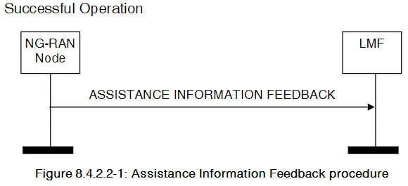

- ASSISTANCE INFORMATION FEEDBACK 메세지 안에 Assistance Information Failure List IE가 포함되어 있다면, LMF는 관련 정보에 대한 assistance information broadcasting이 구성될 수 ㅇ벗다고 간주해야 한다.
- ASSISTANCE INFORMATION FEEDBACK 메세지 안에 Positioning Broadcast Cells IE가 포함되어 있다면, LMF는 해당 IE에 나열된 셀에 피드백이 적용되는 것으로 간주해야 한다.

---

## Measurement Information Transfer

### Measurement

1. General
   - The Measurement procedure allows the LMF to request one or more TRPs in the NG-RAN node to perform and report positioning measurements. This procedure applies only if the NG-RAN node is a gNB
2. Successful Operation

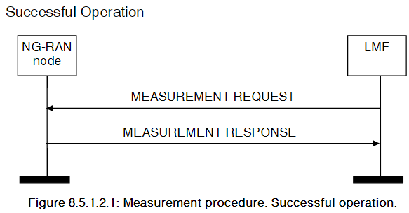

LMF는 MEASUREMENT REQUEST 메세지를 NG-RAN 노드에 보내어, 어떤 TRP에서 measurement를 요청할지를 TRP Measurement Request List IE로 표시한다. NG-RAN 노드는 포함된 정보를 사용하여 지정된 TRP에서 positioning measurement를 configuration한다. 요청된 measurements 중 하나 이상이 최소한 하나의 TRP에 대해 성공했을 때, NG-RAN 노드는 TRP Measurement Response List IE를 포함한 MEASUREMENT RESPONSE 메시지로 응답한다.

- **Report Characteristics IE가 "OnDemand"로 설정된 경우**:
  - NG-RAN 노드는 해당 측정 결과를 MEASUREMENT RESPONSE 메세지에 반환하고, LMF는 이를 NG-RAN 노드에 의해 종료된 것으로 간주한다.
- **Report Characteristics IE가 "Periodic"으로 설정된 경우:**
  - NG-RAN 노드는 해당 측정을 시작하고, MEASUREMENT RESPONSE 메세지에 어떻나 측정 결과도 포함하지 않는다. 그 후 NG-RAN 노드는 요청된 주기로 해당 측정에 대한 Measurement Report 프로시저를 주기적으로 시작하게 된다.
- **Measurement Beam Information Request IE가 포함된 경우:**
  - NG-RAN 노드는 MEASUREMENT RESPONSE 메시지의 TRP Measurement Result IE에 Measurement Beam Information IE를 포함시켜야 한다.
- **Measurement Quality IE가 TRP Measurement Result IE 내에 포함된 경우:**
  - LMF는 이를 측정 품질의 TRP 추정치로 고려할 수 있다. 만약 Measurement Quality IE에 ZZenith Quality IE가 포함된 경우, LMF는 angle measurement quality 내에서 이를 고려할 수 있다.
- **Timing Reporting Granularity Factor IE가 MEASUREMENT REQUEST 메세지의 TRP Measurement Quantities IE에 포함된 경우:**
  - NG-RAN 노드는 UL RTOA와 gNB Rx-Tx Time Difference를 구성할 때 이를 고려할 수 있다.
- **System Frame Number IE or Slot Number IE가 MEASUREMENT REQUEST 메세지에 포함된 경우:**
  - NG-RAN 노드는 해당 정보가 SRS 전송의 활성화 시간을 나타낸다고 간주해야 한다. (지원한다면)
- **Report CharacteristicsIE가 "OnDemand"로 설정되고 Response TimeIE가 MEASUREMENT REQUEST 메시지에 포함된 경우**:** 
  - NG-RAN 노드는 가능한 경우 MEASUREMENT RESPONSE 메시지에서 해당 측정 결과를 지정된 시간 내에 반환해야 합니다.

- **Measurement Characteristics Request IndicatorIE가 MEASUREMENT REQUEST 메시지에 포함된 경우**: 

  - NG-RAN 노드는 가능한 경우 측정을 구성할 때 요청된 측정 특성을 고려하고, 사용 가능한 경우 MEASUREMENT RESPONSE 메시지에 요청된 정보를 포함해야 합니다.

- **Number of TRP Rx TEGsIE가 MEASUREMENT REQUEST 메시지에 포함된 경우**: 

  - NG-RAN 노드는 가능한 경우 지정된 TRP에 대해 동일한 SRS 자원을 다른 TRP Rx TEGs로 측정하고, 해당 TRP에 대한 UL-RTOA 및/또는 gNB Rx-Tx 시간 차이 측정을 보고해야 합니다.

- **Number of TRP RxTx TEGsIE가 MEASUREMENT REQUEST 메시지에 포함된 경우**: 

  - NG-RAN 노드는 가능한 경우 지정된 TRP에 대해 동일한 SRS 자원을 동일한 TRP Tx TEG와 다른 TRP RxTx TEGs로 측정하고, 해당 TRP에 대한 gNB Rx-Tx 시간 차이 측정을 보고해야 합니다.

- **Measurement Time OccasionIE가 MEASUREMENT REQUEST 메시지에 포함된 경우**: 

  - NG-RAN 노드는 가능한 경우 이를 측정 인스턴스의 SRS 측정 시간 횟수로 고려할 수 있습니다.

  

  **Measurement Report procedure와의 상호작용**: 

  - Report CharacteristicsIE가 "Periodic"로 설정되고 Measurement AmountIE가 MEASUREMENT REQUEST 메시지에 포함된 경우, NG-RAN 노드는 가능한 경우 이를 고려해 MEASUREMENT REPORT 메시지를 보내야 합니다. 

 

3. Unsuccessful Operation

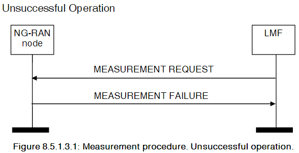

만약 NG-RAN 노드가 MEASUREMENT REQUEST 메세지의 TRP Measurement Request List IE 안에 있는 어떠한 TRP에 있는 requested measurements를 configure 하지 못한다면 MEASUREMENT FAILURE message를 보내게 된다.

### Measurement Report

1. General

Measurement Report procedure는 Ng-RAN 노드가 positioning measurements를 LMF에게 report할 수 있게 한다.

2. Successful Operation

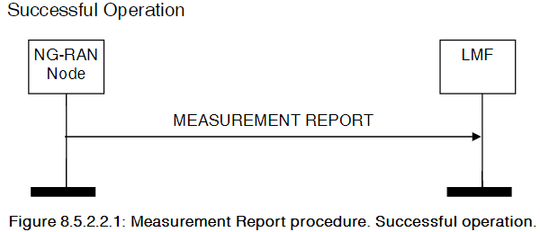

---

### Measurement Update

1. General

The Measurement Update Procedure allows the LMF to notify the NG-RAN node of a change in previously configured measurement.

2. Successful Operation

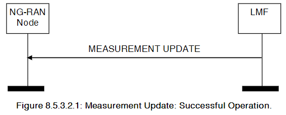

LMF가 MEASUREMENT UPDATE 메세지를 보내 procedure 시작

- **SRS ConfigurationIE가 MEASUREMENT UPDATE 메시지에 포함된 경우**: 
  - NG-RAN 노드는 이전에 저장된 SRS 구성을 덮어씁니다.
- **TRP Measurement Update ListIE의 AoA Search Window InformationIE가 MEASUREMENT UPDATE 메시지에 포함된 경우**: 
  - NG-RAN 노드는 이전에 저장된 AoA 검색 창 정보를 지우고 새로 받은 정보를 저장합니다.
- **TRP Measurement Update ListIE의 Number of TRP Rx TEGsIE가 MEASUREMENT UPDATE 메시지에 포함된 경우**: 
  - NG-RAN 노드는 이전에 저장된 정보를 지우고 새로 받은 정보를 저장합니다.
- **TRP Measurement Update ListIE의 Number of TRP RxTx TEGsIE가 MEASUREMENT UPDATE 메시지에 포함된 경우**: 
  - NG-RAN 노드는 이전에 저장된 정보를 지우고 새로 받은 정보를 저장합니다.
- **Measurement Characteristics Request IndicatorIE가 MEASUREMENT UPDATE 메시지에 포함된 경우**: 
  - NG-RAN 노드는 이전에 저장된 정보를 지우고 새로 받은 정보를 저장합니다.
- **Measurement Time OccasionIE가 MEASUREMENT UPDATE 메시지에 포함된 경우**: 
  - NG-RAN 노드는 이전에 저장된 정보를 지우고 새로 받은 정보를 저장합니다.

### Measurement Abort

1. General

The purpose of the Measurement Abort Procedure is to enable the LMF to abort an on-going measurement. This procedure applies only if the NG-RAN node is a gNB.

2. Successful Operation

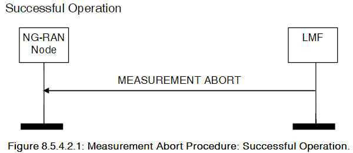

The LMF initiates the procedure by sending a MEASUREMENT ABORT message.

Upon receiving this message, the NG-RAN node shall terminate the on-going measurement identified by the LMF Measurement ID IE and may release any resources previously allocated for the same measurement.

### Measurement Failure Indication

1. General

The Measurement Failure Indication procedure allows the NG-RAN node to notify the LMF that the measurements previously requested with the Measurement procedure can no longer be reported. 

2. Successful Operation

