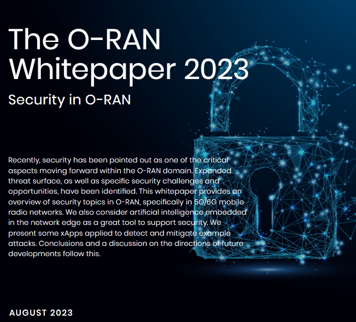
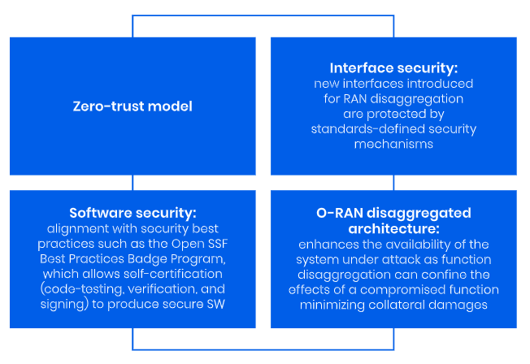

```category: 3GPP
category: [Rimedo_Lab]
tags: [O-RAN]
usemath: [latex, ascii] 
```



# 1 Introduction to O-RAN Security

## 1.1 The Voice of O-RAN Alliance and Operators

 O-RAN은 GSMA Security Assurance Scheme (NESAS)와 European Union Agency for Cybersecurity's 5G Certification Scheme(ENI-SA)에 포함되었다. 앞의 컨소시엄에서 O-RAN의 네트워크 보안을 다음과 같은 방법들로 향상시키기로 결정하였다.

1. 내부 비즈니스 프로세스 공급망 전반에 걸쳐 O-RAN Alliance 및 3GPP security specifications에서 제시한 모든 사양을 따른다.
2. 각 vendor에 zero-trust 원칙을 적용한다.
3. O-RAN 공급 업체라 보안 사양을 의무적으로 준수해야 한다,
4. 다양한 공급업체(중소기업들)을 활용하여 multi vendor 전략을 보장한다
5. O-RAN Alliance가 정해지지 않은 security specification의 대책을 맡는다.


2월 28일에 바르셀로나에서 열린 MWC에서의 O-RAN Alliance Ecosystem Briefing에서 Orange의 Claire Chauvin에 의해 두 기본 원칙이 제기되었다.

1. Security through transparency
   - 보안을 강화하기 위해 정보와 프로세스를 공개하고 투명하게 유지한다.
2. A risk-based(zero-trust) approach
   - 모든 사용자와 장치를 신뢰하지 않고, "무신뢰" 상태에서 사용자 및 장치를 확인하고 보호하는 방식을 의미한다.


## 1.2 The Voice of Vendors and Manufacturers

 2023년 1월 Mavenir는 "Open architecture and supply chain diversity: securing telecoms into the future"라는 새로운 백서를 출판하였다. 이 백서에서 Mavenir는 5개의 보안 원칙을 제시하였다.

1. Open architecture는 공급 다양성을 촉진해야 한다.
   - 다양한 vendor가 시장에 진입할 수 있도록 해야 한다.
2. 하드웨어나 소프트웨어가 특정 vendor에 종속되어서는 안된다.
   - Vendor lock-in을 피해야 한다.

3. 개방적이고 상호 운용 가능한 시스템은 네트워크의 end-to-end 보안에서 완전한 가시성과 제어를 제공해야 한다.
4. 장비나 소프트웨어가 교체 또는 업그레이드 되어야 할 때 전체 시스템에 손상을 일으키지 않아야 한다.
5. 개방적이고 상호 윤용 가능한 시스템은 zero-trust 접근 방식을 채용해야 한다.


## 1.6 Security in O-RAN

 앞의 나온 모든 분야의 의견에서 공통된 내용이 있다. O-RAN에 대한 보안 위협은 결국 functional virtualization과 open interface로부토 비롯된다는 것이다. 그럼에도 불구하고, 앞의 특성은 결국 보안상의 이점을 제공하게 된다. 보안 위협에 인터페이스 상에서 모니터링되며 공격자와 더 가까워질 수 있기 때문이다.



---

# 2. RAN Openness and Intelligence for 5G/6G Security

- RAN-related aspects of 5G/6G security
- Architecture-related risks
- Cybersecurity best practices
- MEC and O-RAN security oopportunities


### 2.1 Architecture-related Risks for 5G/6G Security

1. SBA(Service-Based Architure)의 decomposed, virtualized, distributed 된 네트워크 function들 
   - 네트워크 function들과 infrastructure간의 독립성은 network security의 어려움을 증가시킨다.
2. Application Programming Interfaces (API)
   - 부족한 암호화와 부적절하게 보안화한 API는 네트워크 공격 위험성을 증가시킨다.
3. 


# 3. AI for O-RAN Security

## 3.1 Radio Segment Threats

1. Jamming
2. Denial of Service(DoS), Distributed DoS(DDoS)
3. Signaling Storm
4. Eavesdropping and traffic analysis
5. Main in the Middle(MITM)
6. Free-riding 