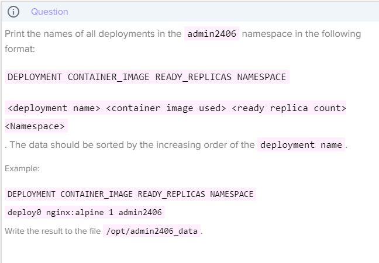

## 여러 단계로 나누어 풀기

### Deploy 출력

```bash
$ kubectl get deployments -n admin2406 -o wide

# 결과
NAME      READY   UP-TO-DATE   AVAILABLE   AGE   CONTAINERS   IMAGES         SELECTOR
deploy1   1/1     1            1           77s   nginx        nginx          app=deploy1
deploy2   1/1     1            1           77s   nginx        nginx:alpine   app=deploy2
deploy3   1/1     1            1           76s   nginx        nginx:1.16     app=deploy3
deploy4   1/1     1            1           76s   nginx        nginx:1.17     app=deploy4
deploy5   1/1     1            1           76s   nginx        nginx:latest   app=deploy5
```


### awk 구문을 이용해 데이터 가공

```
$ kubectl get deployments -n admin2406 | awk '{print $1 " " $7 " " $3 " " "admin2406"}'

NAME IMAGES UP-TO-DATE admin2406
deploy1 nginx 1 admin2406
deploy2 nginx:alpine 1 admin2406
deploy3 nginx:1.16 1 admin2406
deploy4 nginx:1.17 1 admin2406
deploy5 nginx:latest 1 admin2406
```


### 출력 파일을 지정 디렉토리에 저장

```bash
$ kubectl get deployments -n admin2406 -o wide | awk '{print $1 " " $7 " " $3 " " "admin2406"}' > /opt/admin2406_data

저장 후 vi를 사용해 맨위의 admin2406을 Namespace로 바꾼다
```

---

## 한 번에 풀기

### 명령적 커맨드를 이용할 때

```bash
$ kubectl -n admin2406 get deployment -o custom-columns=DEPLOYMENT:.metadata.name,CONTAINER_IMAGE:.spec.template.spec.containers[].image,READY_REPLICAS:.status.readyReplicas,NAMESPACE:.metadata.namespace --sort-by=.metadata.name > /opt/admin2406_data
```

