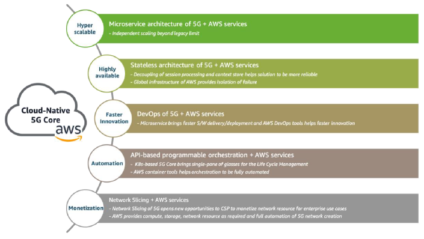

# 5G Network Evolution with AWS

## Introduction

 In 5G, network architectures of Core and RAN become to have an easier transition to the modern innovations of cloud-native software technologies such as microservices, service-based, and stateless architecture.

- **Core Network**: 3GPP defines 5G standalone (SA) Core Network to have decomposed architecture with the introduction of a service-based interface(SBI) using HTTP/2 as a baseline communication protocol. and control plane and user plane separation(CUPS)

 **Agility, fast innovation, hyper scalability, elasticity, simplified operations** and **lifecycle management(LCM)** can be realized only when the 5G network functions(NFs) are designed and implemented on a cloud-native container-based microservices architecture.

 This whitepaper describes a reference architecture of 5G on AWS to help CSPs and NEPs build a carrier-grade 5G production network, in the wide spectrum of views such as design, deployment model, use cases, and AWS tools.

 Also, this whitepaper highlights how AWS Outposts, Local Zones, and Wavelength can contribute to building a seamless 5G Network with providing the best value.

---

## Building blocks of AWS services for 5G network implementation

Why people use AWS services?

- **For scaling**, Elastic Load Balancing offers Application Load Balancer, which offers WebSocket support and Network Load Balancer that can handle millions of requests per second.
- **For network acceleration**, AWS Global Accelerator provides static IP addresses that act as a fixed entry point to your application endpoints in AWS. It has support for static IP addresses for the load balancer.
- **For reduced latency, cost, and increased bandwidth throughput**, AWS Direct Connect establishes dedicated network connection from on-premises to AWS. Highly available managed IP SIP trunking is provided by Amazon Chime Voice Connector.

AWS is the most preferred platform for developers to run their container-based microservice application. 

 This container-based microservice application can be empowered by many AWS services, including AWS Elastic Kubernetes Service for managed Kubernetes service, App Mesh for service-mesh, and AWS Cloud Map for application resource discovery.

---

## Cloud-native core network evolution with AWS

This section will cover how key benefits can be ensured and implemented in AWS environment.

### 5G SA core characteristics and feature parity with AWS Services

