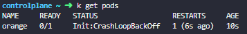
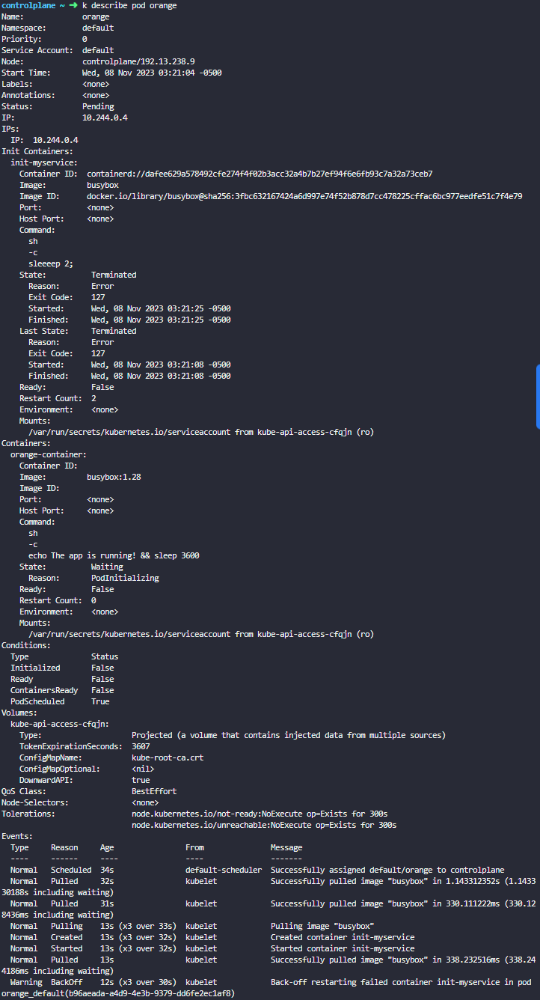

> A new application <kbd>orange</kbd> is deployed. There is something wrong with it. Identify and fix the issue.


# Pod Troubleshooting

## Pod 상태 확인

```bash
$ kubectl get pods
```




### 에러 Pod에 describe 커맨드 실행

```bash
$ kubectl describe pod orange
```



아래 부분에 Warning을 보면 <kbd>init-myservice </kbd>에 문제가 있음을 알 수 있다.

에러가 난 부분을 찾아보기 위해 다음과 같은 커맨드를 실행한다.

```bash
$ kubectl logs orange init-myservice

#예시 에러:
#sh: sleeeep: not found
```


Edit 커맨드를 활용하여 에러를 고친다.

```bash
$ kubectl edit pod orange
```

